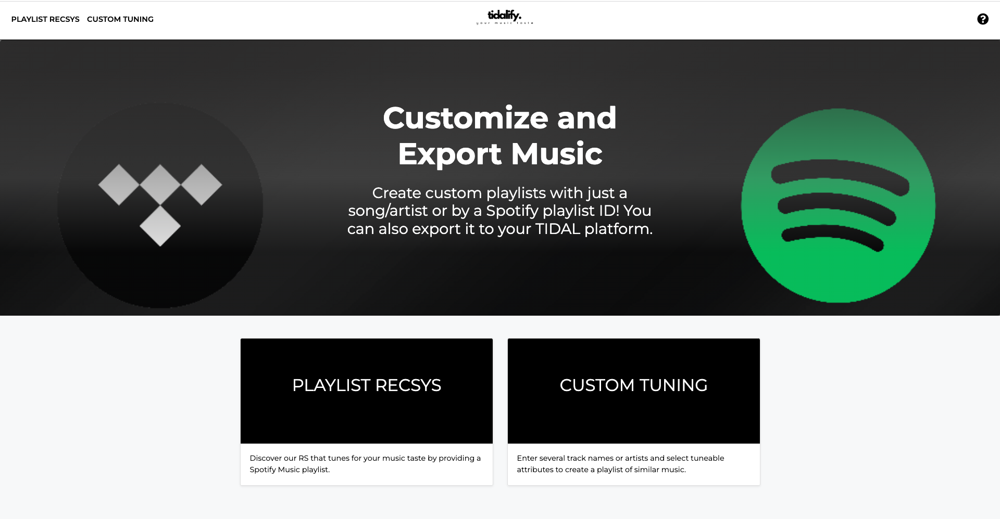
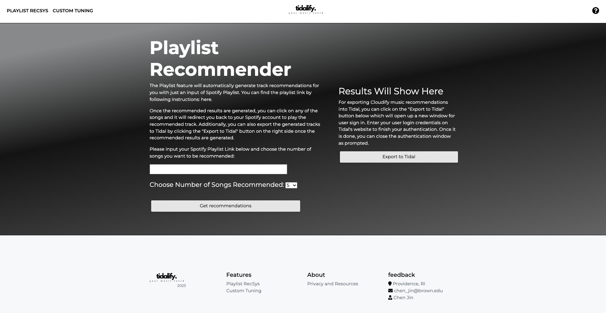
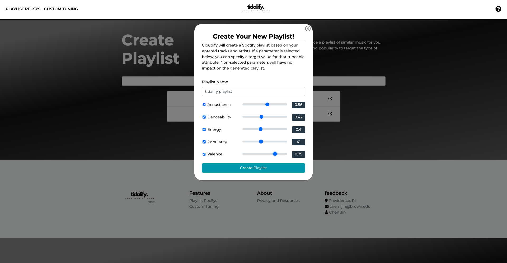

# Tidalify - Enhanced Music Recommender Engine with Machine Learning and Custom Tuning [Spotify & TIDAL]



A Flask project that offers two features of which provides music recommendations to users based on Spotify music platform.

## Feature 1: Recommender System based on Content-Based Filtering Algorithm

- This project uses data from 2018 RecSys where 1 million playlist are provided as raw data set
- The Content-Based Filtering algorithm is referenced from the below framework workflow

  - **Part I**: [Extracting song data from Spotify’s API in Python](https://cameronwwatts.medium.com/extracting-song-data-from-the-spotify-api-using-python-b1e79388d50)
  - **Part II**: EDA and Clustering
  - **Part III**: [Building a Song Recommendation System with Spotify](https://medium.com/@enjui.chang/part-iii-building-a-song-recommendation-system-with-spotify-cf76b52705e7)
  - **Part IV**: [Deploying a Spotify Recommendation Model with Flask](https://medium.com/@yaremko.nazar/deploying-a-spotify-recommendation-model-with-flask-20007b76a20f)
  - **Part IV**: [Deploying a Spotify Recommendation Model with Flask](https://medium.com/@yaremko.nazar/deploying-a-spotify-recommendation-model-with-flask-20007b76a20f)

- Based on the prediction algorithm, we fetch recommended songs (under Spotify context) and gave users the ability to export into their own TIDAL music account
  - this is done through TIDAL's oauth2 protocol for user authorization. This project used the `tidalapi` API for user authorization. For further references: [`tidalapi` Documentation](https://pypi.org/project/tidalapi/)



## Feature 2: `/Recommend` API & User Tuning

For `Custom Tuning` feature, user have the ability to alter some of the audio features (12 sonic characteristics that are availble through Spotify API) for music recommendation. They can input their favorite songs or artists along with `auio_features` to generate a playlist recommended to them straight back in their Spotify playlist. This feature uses the Spotify's oauth protocol for user authentication.



## Information Page

For more information regarding the functionalities offered in this projuct, please refer to the `information` page. Since the application needs to access features within Spotify SDK, it requires certain user scopes. You can also revoke `permissions` from the link provided here.

## How to use

To clone the repository:

```sh
git clone https://github.com/chen-jin021/music-rs.git
```

To install the dependencies:

```
pip install -r requirements.txt
```

You will also need to set up your own environment variables for Spotify and Tidal. Variables like `CLIENT_ID`, `CLIENT_SECRET` are used for API calls to these two music platforms. For Spotify API acquisition, please aquire necessary credentials here [Spotify for developers](https://developer.spotify.com/) account. You will also need to set up the callback route within Spotify Developer Dashboard for rerouting. Simiarly for TIDAL.

## Repo Structure

```
├── README.md              <- The top-level README for developers using this project.
│
├── reference
│   ├── notebooks          <- Serialized Jupyter notebooks created in the project.
│       ├── script         <- Script for data extraction and loading data
│       ├── Extraction     <- Data extraction using Spotify API
│       ├── EDA            <- Exploratory data analysis process.
│       └── Recsys         <- The training of traditional statistical models.
│   ├── data
│       ├── raw            <- The original, immutable data dump.
│       ├── processed      <- The preprocessed data sets for training.
│       ├── test           <- The test data sets for testing.
│       └── final          <- The final data sets for modeling.
│   ├── models             <- Trained models, model predictions, or model summaries.
│
├── application            <- Code for model deployment and website design
│
├── data1                  <- Pretrained data for model
│
├── venv                   <- Environment
│
└── requirements.txt       <- The requirements file for reproducing the analysis environment.
```
